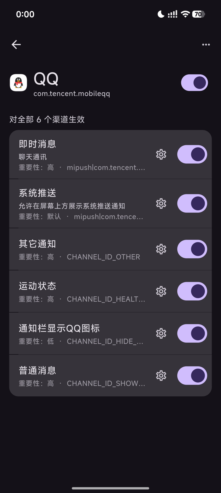

# Features

HyperIsland provides rich Super Island notification enhancement features for HyperOS 3, making your notification experience more modern.

## App Features

### App Adaptation

Enable Super Island functionality for any app, with individual configuration per app.

- **Search**: Quickly search by app name or package name
- **Individual Switch**: Control enable/disable per app independently
- **Bulk Management**: View the number of enabled apps at a glance

### Notification Channel Management

For apps supporting multiple notification channels (like QQ), configure each channel separately:

- **Instant Messages**: Chat and messaging notifications
- **System Push**: System-level push notifications
- **Other**: Custom channel notifications
- **Sports**: Health and fitness notifications

Each channel can independently set templates and styles.

## Super Island Customization

### Template Selection

Choose the appropriate Super Island template for each app/channel:

| Template | Description |
|:---------|:------------|
| Notification Super Island | Convert any notification to Focus Notification + Super Island |
| Notification Super Island - Lite | Auto-remove "x new messages" and duplicate fields |
| Download | Auto-detect download status and convert to Super Island |
| Download - Lite | Super Island shows only icon + progress ring |
| AI Notification Super Island | AI simplifies left and right sides |

### Style Configuration

- **Style**: New Icon-Text Component + Bottom Text Buttons
- **Island Icon**: Auto or custom icon selection
- **Large Island Icon**: Toggle large island icon display
- **Initial Expand**: Auto-expand when notification first appears
- **Update Expand**: Auto-expand when notification updates
- **Message Scroll**: Toggle text scrolling within the island

### Island Display Settings

- **Auto Dismiss**: Set seconds before Super Island auto-hides
- **Highlight Color**: Custom highlight color (supports HEX values)
- **Text Highlight**: Choose left or right text highlight

## Focus Notification Customization

### Focus Notification Settings

- **Focus Icon**: Choose icon in the Focus Notification panel
  - Auto: Use app's default icon
  - Custom: Manually select icon
- **Focus Notification**: Control Focus Notification display mode
  - Default (On): Normal Focus Notification display
  - Off: No Focus Notification panel
- **Status Bar Icon**: Toggle status bar icon display
- **Lock Screen Restore**: Restore normal notification style on lock screen

### Focus Notification Bypass

::: danger Built-in Bypass
The app includes a built-in whitelist bypass. It doesn't support safe mode and may cause System UI to crash infinitely. Make sure you can recover your device before enabling.
:::

Through HyperCeiler or built-in bypass, you can:
- Remove Focus Notification whitelist restrictions
- Unlock Focus Notification whitelist verification
- Enable any app's notifications to display as Focus Notifications

## Download Manager Extension

Intercept HyperOS download manager notifications and display them in Super Island style with filename and progress.

::: tip Core Features
- Real-time download progress display
- Support **Pause**, **Resume**, **Cancel** operations
- Auto-dismiss after download completes
:::

::: tip How to Enable
Download Island is disabled by default. Go to the app, enable **"Show System Apps"**, and check **"Download Manager"**.
:::

## Hot Reload Support

Configuration changes take effect **without restart**. After installing or updating the app, just restart the scope.

::: tip Convenience
This means you can adjust module settings anytime without waiting for a device restart. Most configuration changes take effect immediately after saving.
:::
